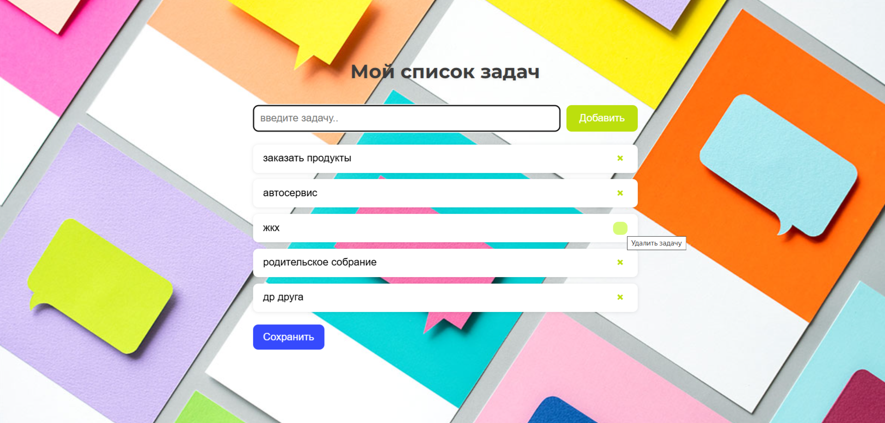

# 📝 Мой список задач (Todo List)
Автор: Проходцева Полина

Простое веб-приложение для создания и управления списком задач.  
Позволяет добавлять, удалять и сохранять задачи между перезагрузками страницы.

## ✨ Возможности

- Добавление задач через поле ввода или клавишу **Enter**
- Удаление отдельных задач по кнопке **×**
- Сохранение всего списка в браузере (с помощью `localStorage`)
- Автоматическая загрузка сохранённого списка при открытии страницы
- Адаптивный дизайн и приятный визуальный стиль

## ▶️ Как запустить

1. Скачайте или клонируйте репозиторий:
   git clone <https://https://github.com/Polyapolyapolya/ToDoList>
2. Откройте файл index.html в любом современном браузере (Chrome, Firefox, Edge и т.д.).
3. Начните добавлять задачи!
